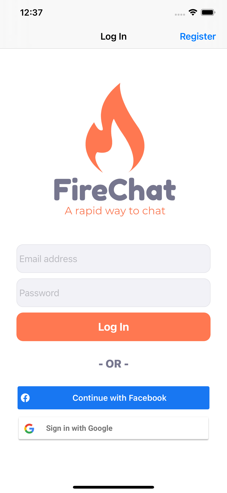
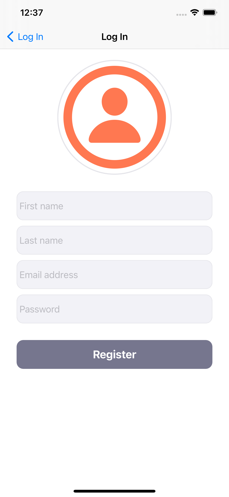
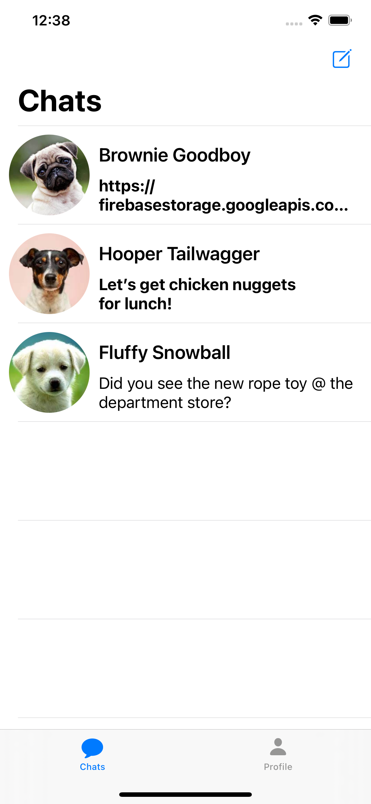
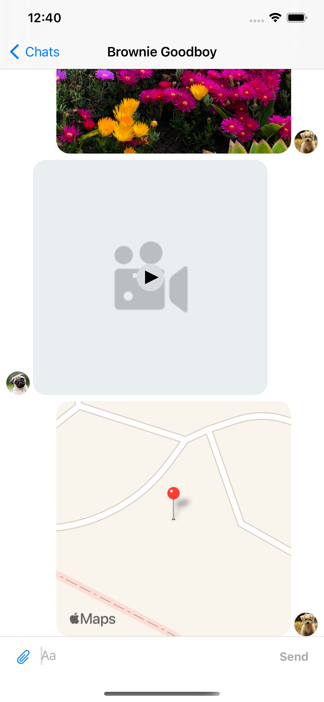
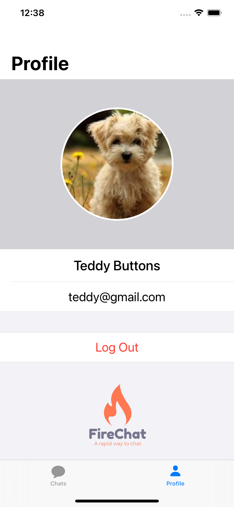
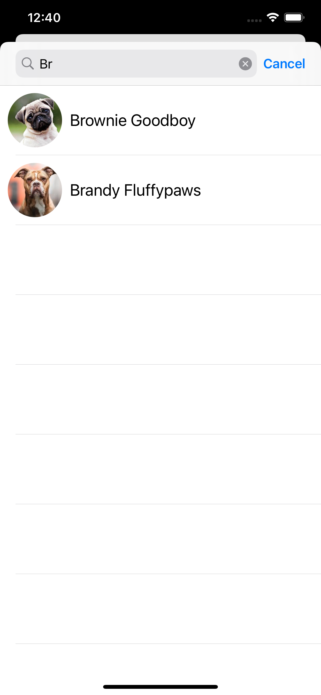

# FireChat
iOS real-time chat application using Firebase.

## Features
- Email/Password registration and log in
- Google Sign In
- Facebook Log In
- Real time conversations
- Types of messages supported:
  - Text messages
  - Photo messages
  - Video messages
  - Location messages
- Search for other users
- Deleting conversation
- User profile
- Dark mode support

## Screenshots of the application

- Login page
  

- New user registration page

- Home page

- Chat view

- Profile page

- Search contacts page

